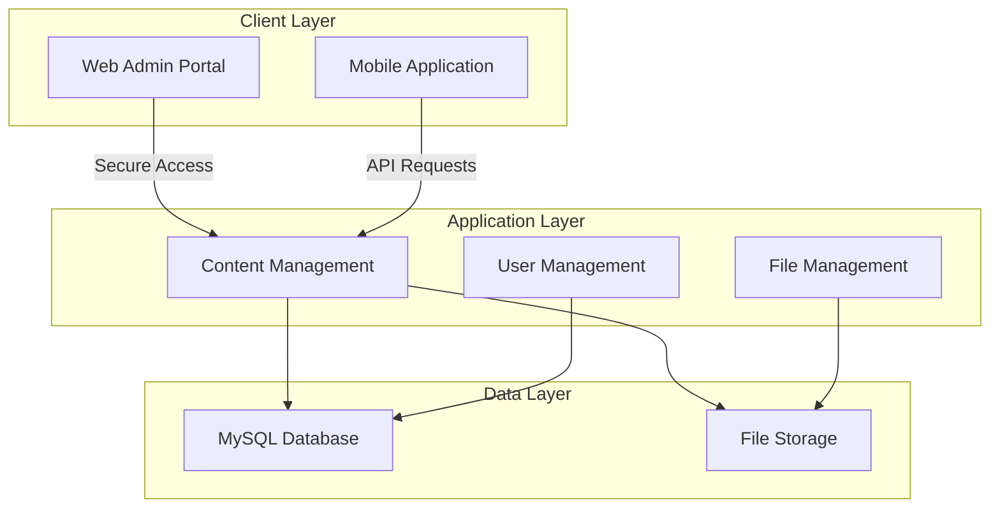

# DLSA Tinsukia - Legal Services Management System
### A Comprehensive Digital Solution for District Legal Services Authority

## Abstract

The District Legal Services Authority (DLSA) Tinsukia Digital Platform represents a pioneering initiative in improving public access to legal information and resources. This project addresses the critical need for easily accessible, up-to-date information about various government programs, services, and initiatives in the Tinsukia district of Assam, India. The solution comprises two integrated components: a web-based administrative portal and a user-centric mobile application, designed to bridge the information gap between authorities and citizens.

The web administrative portal, developed using the Laravel PHP framework, serves as the content management system, enabling DLSA officials to publish, update, and manage information about various programs and initiatives. It incorporates robust content management capabilities, including dynamic content updates, document publishing, and efficient information organization. The portal's architecture emphasizes content accessibility, easy updates, and systematic information categorization.

The mobile application, developed using Flutter framework, provides citizens with convenient access to information through their smartphones. It offers a user-friendly interface for browsing resources, accessing program details, viewing latest updates, and staying informed about awareness programs and events. The application's offline capabilities and multi-language support ensure information accessibility across diverse user groups and varying network conditions.

The system's architecture implements a streamlined content delivery system between the web portal and mobile application, ensuring information consistency and timely updates. The solution utilizes MySQL for content management, incorporating efficient categorization and search capabilities for easy information retrieval.

Key innovations include the implementation of a tag-based content organization system, structured document presentation, and an intuitive user interface that makes information easily discoverable. The platform's organization capabilities provide a systematic approach to presenting various programs and initiatives.

Initial deployment results demonstrate significant improvements in public awareness and accessibility of information. The system's modular design allows for future enhancements, including additional content categories and improved search capabilities, positioning it as a scalable solution for public information dissemination.

This project represents a significant step toward digital transformation in public information accessibility, offering a replicable model for other districts and authorities. The solution aligns with the Digital India initiative and demonstrates the potential of technology in enhancing public awareness and understanding of government programs.

## Introduction

In an era where digital transformation is reshaping public information accessibility, awareness about government programs and initiatives remains a critical challenge in many regions of India. The District Legal Services Authority (DLSA) of Tinsukia, recognizing this challenge, has undertaken a pioneering initiative to digitalize its information dissemination through an integrated digital platform. This transformation aims to address the fundamental barrier of information accessibility that citizens face when seeking to understand various programs and initiatives.

The traditional system of accessing public information often involves visiting physical offices, searching through printed materials, or relying on periodic awareness camps, creating significant barriers for citizens seeking to learn about available programs. These challenges are particularly acute in regions where geographical distance, limited resources, and lack of awareness compound the difficulties in accessing this crucial information. The DLSA Tinsukia Digital Platform emerges as a solution to these challenges, leveraging modern technology to create a more accessible information ecosystem.

This project introduces a dual-component system: a comprehensive web-based administrative portal for DLSA officials to manage and publish information, and a user-friendly mobile application for citizens to access this information. The integration of these components creates a seamless digital environment that facilitates efficient information dissemination, document access, and awareness building. By implementing state-of-the-art technologies such as Laravel for the web portal and Flutter for the mobile application, the system ensures easy content management, accessibility, and user-friendly information retrieval.

The platform's development has been guided by the need to make information more accessible and understandable to the general public while maintaining the accuracy and authority of the content. This report details the conceptualization, development, implementation, and impact of the DLSA Tinsukia Digital Platform, providing insights into its potential as a model for improving public awareness and information accessibility across India.

## Problem Statement

The District Legal Services Authority (DLSA) Tinsukia faces several challenges in effectively disseminating information to the public. These challenges can be categorized as follows:

### Information Accessibility Issues
• Limited physical access to information at DLSA office
• Dependency on office hours for information retrieval
• Geographical barriers for remote area residents
• Lack of centralized information repository
• Difficulty in accessing updated information

### Content Management Challenges
• Manual handling of information updates
• Inconsistent information organization
• Difficulty in maintaining current versions
• Time-consuming content distribution process
• Limited ability to categorize information

### Public Awareness Barriers
• Lack of immediate access to latest updates
• Limited reach of awareness programs
• Difficulty in disseminating time-sensitive information
• Language barriers in information access
• Inconsistent information delivery channels

### Technical Limitations
• Absence of digital platform for information sharing
• No mobile-based access solution
• Limited offline information availability
• Lack of systematic content organization
• No mechanism for instant updates

### Administrative Inefficiencies
• Time-consuming information update process
• Manual content management workflow
• Difficulty in tracking information dissemination
• Limited control over information distribution
• Inefficient document management system

### Resource Utilization
• High dependency on physical resources
• Increased operational costs
• Inefficient use of human resources
• Limited reach despite resource investment
• Redundant information management efforts

These challenges necessitate a comprehensive digital solution that can address these issues while providing an efficient platform for information dissemination and access.

## Objectives

The DLSA Tinsukia Digital Platform project aims to achieve the following objectives:

### Primary Objectives
• To develop an integrated digital platform that enhances public access to information through web and mobile interfaces

• To create a robust content management system enabling DLSA administrators to efficiently manage and distribute information

• To implement a user-friendly mobile application that provides offline access to important information for citizens

• To establish a systematic approach for organizing and categorizing information, making it easily discoverable for the public

• To reduce geographical and temporal barriers in accessing DLSA information through digital means

### Technical Objectives
• To build a secure and scalable web-based administrative portal using Laravel framework

• To develop a cross-platform mobile application using Flutter that ensures consistent user experience across devices

• To implement efficient data synchronization mechanisms for offline content access

• To create an intuitive content management interface that simplifies the information update process

### Operational Objectives
• To streamline the information dissemination process and reduce manual intervention

• To establish a structured workflow for content creation, review, and publication

• To implement multi-language support for broader accessibility

• To provide analytics and tracking mechanisms for monitoring information reach and effectiveness

### Long-term Objectives
• To create a replicable model for other District Legal Services Authorities

• To continuously improve the platform based on user feedback and usage patterns

• To establish a sustainable digital ecosystem for public information accessibility

## Scope

The scope of the DLSA Tinsukia Digital Platform encompasses the development of both web and mobile applications focused on information dissemination. The system includes a comprehensive admin portal for content management and a public-facing mobile application for information access. The platform will handle various types of content including text, documents, images, and notifications. While the system focuses on information distribution, it does not include case management, legal consultation, or direct service delivery components. The project's implementation is limited to the Tinsukia district, though designed with scalability in mind for potential future expansion to other districts.

## System Requirements

### A. Web Administrative Portal Requirements

#### 1. Hardware Requirements (Server)
• Processor: Intel Xeon or equivalent, 2.0 GHz or higher
• RAM: 4GB minimum (8GB recommended)
• Storage: 50GB SSD minimum
• Network: High-speed internet connection (10 Mbps or higher)
• Backup: External storage for database backups

#### 2. Hardware Requirements (Admin Users)
• Processor: Intel Core i3 or equivalent
• RAM: 4GB minimum
• Storage: 256GB HDD/SSD
• Display: 1366 x 768 resolution or higher
• Internet: Broadband connection (2 Mbps or higher)

#### 3. Software Requirements (Server)
• Operating System: Ubuntu 20.04 LTS or higher
• Web Server: Apache 2.4 or Nginx
• Database: MySQL 5.7 or higher
• PHP Version: 8.0 or higher
• SSL Certificate: Valid SSL for HTTPS
• Backup Software: Automated backup solution

#### 4. Software Requirements (Admin Users)
• Operating System: Windows 10/11, macOS 10.15+, or Linux
• Web Browser: 
  - Google Chrome (latest version)
  - Mozilla Firefox (latest version)
  - Microsoft Edge (latest version)
• PDF Reader: Adobe Acrobat Reader or equivalent
• Office Suite: Microsoft Office or equivalent
• Antivirus: Updated antivirus software

### B. Mobile Application Requirements

#### 1. Hardware Requirements (Android Users)
• Processor: 1.4 GHz quad-core or higher
• RAM: 2GB minimum
• Storage: 100MB free space
• Display: 720 x 1280 pixels or higher
• Android Version: 5.0 (Lollipop) or higher
• Internet: 3G/4G/Wi-Fi connectivity

#### 2. Hardware Requirements (iOS Users)
• Device: iPhone 6s or newer
• Storage: 100MB free space
• iOS Version: iOS 11.0 or higher
• Internet: 3G/4G/Wi-Fi connectivity

#### 3. Software Requirements (Mobile App)
• Operating System:
  - Android: Version 5.0 or higher
  - iOS: Version 11.0 or higher
• Google Play Services (for Android)
• App Store access (for iOS)
• PDF viewer capability
• Image viewer support
• Internet browser

#### 4. Additional Requirements
• Push notification support
• GPS capability (optional)
• Camera access (optional)
• File system access
• Storage permission

### C. Development Environment Requirements

#### 1. Hardware Requirements
• Processor: Intel Core i5 or higher
• RAM: 16GB minimum
• Storage: 512GB SSD
• Display: 1920 x 1080 resolution
• Graphics: Integrated graphics sufficient

#### 2. Software Requirements
• IDE/Code Editors:
  - Visual Studio Code
  - Android Studio
  - Xcode (for iOS development)
• Version Control: Git
• Development Frameworks:
  - Laravel Framework
  - Flutter SDK
• Database Management: MySQL Workbench
• API Testing: Postman
• Browser Developer Tools
• Command Line Tools

## 5.3 TOOLS AND TECHNOLOGIES

The integrated development environment to develop the application, and the third-party tools used for development and implementation purposes are as follows:

### 5.3.1 BACKEND TECHNOLOGIES
• Laravel Framework (Laravel 9.x): Primary web application framework
• PHP Programming Language (PHP 8.0+): Server-side scripting and application logic
• Composer: Dependency management for PHP packages
• RESTful API: For mobile app communication
• JWT Authentication: Token-based authentication system

### 5.3.2 DATABASE TECHNOLOGY
• MySQL Database (MySQL 5.7+): Primary database management
• SQLite: Local storage for mobile application
• Database Migrations: Version control for database schema
• Query Builder: For complex database operations
• Eloquent ORM: Object-Relational Mapping for database interactions

### 5.3.3 FRONTEND TECHNOLOGIES
• HTML5 & CSS3: Structure and styling of web portal
• JavaScript: Client-side interactivity and dynamic content
• Tailwind CSS: Utility-first CSS framework for responsive design
• Alpine.js: Minimal JavaScript framework for frontend
• Flutter Framework: Cross-platform mobile app development
• Dart Programming Language: Primary language for mobile app

### 5.3.4 DEVELOPMENT TOOLS
• Visual Studio Code: Primary IDE for web development
• Android Studio: Mobile app development and testing
• Git & GitHub: Version control and collaboration
• Postman: API testing and documentation
• MySQL Workbench: Database administration
• Laravel Artisan: Command-line interface for Laravel
• Flutter CLI: Command-line tools for Flutter development

### 5.3.5 ADDITIONAL TOOLS AND LIBRARIES
• CKEditor: Rich text editing capabilities
• Laravel Storage: File system abstraction for document management
• Laravel Session: Session handling and management
• Laravel Security: Built-in security features and hashing
• Flutter Packages:
  - shared_preferences: Local data storage
  - http: API communication
  - provider: State management
  - sqflite: SQLite database management
• Figma: UI/UX design and prototyping
• Draw.io: System architecture and flow diagrams

## 7. FEASIBILITY STUDY

A feasibility analysis is undertaken to determine the possibility or probability of either improving the existing system or developing a completely new system. It helps to obtain an overview of the problem and to get rough assessment of whether feasible solution exists.

In feasibility analysis section, we found out the feasibility of our system from four points of view:
• Technical Feasibility
• Economic Feasibility
• Operational Feasibility
• Legal Feasibility

### 7.1 Technical Feasibility

The development of the DLSA Tinsukia Digital Platform using Laravel, Flutter, and MySQL is highly feasible from a technical perspective. Laravel provides a robust PHP framework with built-in features for authentication, routing, and database operations, making it ideal for developing the administrative portal. Flutter offers cross-platform development capabilities, ensuring the mobile application can reach both Android and iOS users efficiently.

The technical stack chosen is well-established and proven:
- Laravel's MVC architecture ensures clean, maintainable code
- MySQL provides reliable data storage and retrieval capabilities
- Flutter's widget-based architecture enables responsive and native-like mobile applications
- RESTful APIs facilitate seamless communication between web and mobile components
- Modern development tools support efficient development and debugging

The system can be easily scaled and modified to accommodate future requirements, making it technically sustainable for long-term use.

### 7.2 Economic Feasibility

The DLSA Tinsukia Digital Platform is economically feasible due to its use of open-source technologies and cost-effective development approach:

Cost Considerations:
- Development Tools: Most tools are open-source or have free tiers
- Hosting: Minimal server requirements reduce hosting costs
- Maintenance: Built-in tools for easy updates and maintenance
- Training: Intuitive interfaces minimize training requirements
- Mobile Distribution: Standard app store distribution channels

Long-term Benefits:
- Reduced operational costs through digitization
- Minimized paper and physical resource usage
- Efficient information distribution
- Reduced manual effort in content management
- Sustainable long-term investment in digital infrastructure

### 7.3 Operational Feasibility

The system demonstrates strong operational feasibility through its user-centric design and efficient workflows:

Administrative Operations:
- Intuitive content management interface
- Streamlined publishing workflow
- Easy-to-use administrative tools
- Minimal training requirements
- Efficient content organization system

Public Usage:
- User-friendly mobile interface
- Offline access capabilities
- Multi-language support
- Simple navigation structure
- Minimal technical requirements for users

The system can be easily adopted by both administrative staff and the public, requiring minimal technical expertise for basic operations.

### 7.4 Legal Feasibility

The system has been designed with careful consideration of legal requirements and compliance:

Data Protection:
- Secure user data handling
- Privacy-compliant information storage
- Transparent data collection practices
- Secure authentication mechanisms
- Regular security updates

Compliance Measures:
- Adherence to government guidelines
- Implementation of necessary disclaimers
- Proper attribution of information sources
- Compliance with digital accessibility standards
- Regular security audits and updates

Additional Considerations:
- Content moderation capabilities
- Version control for legal documents
- Audit trail for administrative actions
- Secure data backup procedures
- Compliance with mobile app store policies

The system ensures all legal requirements are met while maintaining transparency and security in information dissemination.

## 8. FUTURE SCOPE

The DLSA Tinsukia Digital Platform demonstrates significant potential for future growth and enhancement, positioning itself as a cornerstone for digital transformation in legal information dissemination. The platform's architecture has been designed with scalability and extensibility in mind, allowing for seamless integration of new features and capabilities. In the immediate future, the system can be enhanced with advanced mobile capabilities, including improved offline functionality and multimedia content support, making information more accessible to users in areas with limited connectivity. The implementation of artificial intelligence and machine learning algorithms could revolutionize content management and user experience, enabling automated content categorization, personalized recommendations, and intelligent search capabilities. Language accessibility can be significantly expanded through the integration of additional regional languages and dialects, complemented by text-to-speech functionality and voice-over support, making the platform more inclusive for diverse user groups. The system's analytics capabilities can be enhanced to provide deeper insights into user behavior and content effectiveness, enabling data-driven decisions for continuous improvement. Integration with other government portals and external systems presents opportunities for creating a more comprehensive digital ecosystem, facilitating seamless information exchange and service delivery. Security and compliance features can be strengthened through the implementation of advanced authentication methods, enhanced encryption protocols, and automated security audits, ensuring the platform remains secure and trustworthy. The content management system can be evolved to include AI-powered suggestions, automated validation, and enhanced version control, streamlining the administrative workflow. Geographic expansion to other districts and potential state-wide implementation could create a standardized platform for legal information dissemination across the region. The user interface can be enhanced with personalization features, interactive elements, and virtual assistance, making the platform more engaging and user-friendly. Infrastructure improvements, including cloud migration and advanced load balancing, will ensure the system remains performant and reliable as it scales.

Key Future Enhancements:

1. Mobile and Accessibility
   • Enhanced offline content synchronization
   • Multi-language support with voice-over capabilities
   • Accessibility features for differently-abled users
   • Interactive multimedia content integration

2. Technology and Infrastructure
   • AI/ML implementation for content management
   • Cloud infrastructure migration
   • Advanced security protocols
   • Improved data analytics capabilities

3. User Experience and Interface
   • Personalized user dashboards
   • Virtual assistance integration
   • Interactive help systems
   • Custom notification preferences

4. System Integration and Expansion
   • Integration with government portals
   • Cross-platform data synchronization
   • Geographic expansion capabilities
   • Centralized management system

5. Content and Services
   • Automated content categorization
   • Digital document verification
   • Real-time update system
   • Advanced search functionality

These enhancements will contribute to making the platform more robust, user-friendly, and efficient in serving its purpose of public information dissemination while maintaining security and reliability.

## Project Overview
The DLSA Tinsukia project is a comprehensive digital solution designed to streamline and modernize the operations of the District Legal Services Authority in Tinsukia. The system consists of two main components:
1. Web-based Admin Portal (DLSA_Tinsukia)
2. Mobile Application for Users (dlsa_tinsukia_app)

## Proposed System

The proposed DLSA Tinsukia Digital Platform is a comprehensive web and mobile-based information system that addresses the challenges of public information accessibility while introducing modern features for efficient content management and distribution.

Key Components of the Suggested Solution:

### Secure Administrative Access
• Multi-level authentication for administrative users
• Role-based access control (Super Admin, Content Managers, Editors)
• Session management with automatic timeout
• Secure password policies and encryption

### Content Management System
• Dynamic content creation and organization
• Category and tag-based content structuring
• Document and media upload capabilities
• Content versioning and scheduling
• Multi-language content support
• Real-time content updates

### Information Distribution System
• Category-wise information organization
• Easy-to-navigate content hierarchy
• Advanced search functionality
• Latest updates and notifications
• Document viewing and downloading
• Offline content access in mobile app

### Mobile Application Features
• Cross-platform accessibility (Android & iOS)
• Offline content synchronization
• Push notification system
• Bookmark and favorites functionality
• Content sharing capabilities
• Multi-language interface
• Dark/Light theme options

### System Administration
• Content approval workflow
• User management and access control
• System performance monitoring
• Content analytics and reporting
• Backup and recovery management
• System settings configuration

### Technical Infrastructure
• Secure web hosting environment
• Database management system
• File storage and CDN integration
• API gateway for mobile app
• Backup and disaster recovery
• Performance optimization

System Architecture:

Implementation Requirements:

1. Server Infrastructure
   • PHP 8.0+ with Laravel Framework
   • MySQL Database Server
   • Apache/Nginx Web Server
   • SSL Security
   • 2GB RAM (minimum)
   • 20GB Storage (minimum)

2. Client Requirements
   • Modern Web Browsers
   • Android 5.0+ / iOS 11+
   • Internet Connectivity
   • 100MB Free Space (Mobile App)

3. Development Stack
   • Laravel (Backend Framework)
   • Flutter (Mobile Development)
   • MySQL (Database)
   • RESTful APIs
   • Git (Version Control)

The proposed system emphasizes:
• User-friendly interface
• Efficient content management
• Secure administrative access
• Reliable information delivery
• Offline accessibility
• Scalable architecture

This solution provides a robust platform for DLSA Tinsukia to effectively manage and distribute information to the public through both web and mobile interfaces.

## Implementation Details

### Web Admin Portal Implementation
1. Backend Architecture
   - MVC Pattern implementation
   - RESTful API endpoints
   - Middleware implementation
   - Database migrations
   - Service layer architecture

2. Frontend Implementation
   - Responsive design
   - Interactive dashboard
   - Real-time updates
   - Progressive Web App features

### Mobile Application Implementation
1. App Architecture
   - Clean architecture
   - Modular design
   - Offline capability
   - Push notification integration

2. User Interface
   - Material Design implementation
   - Responsive layouts
   - Custom widgets
   - Multi-language support

## Testing and Quality Assurance
1. Testing Methodologies
   - Unit Testing
   - Integration Testing
   - User Acceptance Testing
   - Performance Testing

2. Quality Metrics
   - Code coverage
   - Performance benchmarks
   - User satisfaction metrics
   - Error tracking and logging

## Deployment
1. Web Portal Deployment
   - Server requirements
   - Configuration setup
   - SSL implementation
   - Database setup

2. Mobile App Deployment
   - Play Store deployment
   - App Store deployment
   - CI/CD pipeline
   - Version management

## Future Enhancements
1. Planned Features
   - AI-powered legal assistance
   - Video conferencing integration
   - Blockchain for document verification
   - Advanced analytics dashboard

2. Scalability Plans
   - Multi-district implementation
   - Cloud infrastructure migration
   - Performance optimization
   - API versioning

## Project Benefits
1. For Citizens
   - Easy access to legal services
   - Reduced paperwork
   - Time-saving
   - Transparent process
   - Real-time updates

2. For Administration
   - Efficient management
   - Digital record keeping
   - Analytics and insights
   - Reduced manual work
   - Better resource allocation

## CHAPTER 9: SYSTEM TESTING

### 9.1 ACCEPTANCE TESTING

The DLSA Tinsukia Digital Platform underwent comprehensive acceptance testing to validate system functionality against user requirements and business objectives. The web portal testing focused on administrative workflows including content management, user authentication, and file handling capabilities. Administrators successfully demonstrated the ability to create, edit, and publish content across various categories, with proper validation of multimedia content uploads and document management. The mobile application testing emphasized user experience and content accessibility, with public users validating information retrieval, offline content access, and multi-language support functionality. Key acceptance criteria included successful content synchronization between web and mobile platforms, proper implementation of role-based access controls, and accurate content categorization. The testing process involved DLSA staff members, content managers, and selected public users who evaluated the system's usability across different devices and platforms. Results showed high acceptance rates for core functionalities, with users particularly appreciating the intuitive interface design and smooth navigation flow. All identified issues were addressed through iterative improvements, ensuring the final system met stakeholder expectations and operational requirements.

### 9.2 PERFORMANCE TESTING

Performance testing evaluated the system's responsiveness, stability, and resource utilization under various operational conditions. The web portal demonstrated consistent performance with optimal page load times and API response times during peak usage. Load testing simulated concurrent access by multiple users, with the system maintaining stable performance and efficient resource utilization well within server capacity. Database optimization efforts resulted in efficient query execution, with content searches completing rapidly and reliably. The mobile application showed exemplary performance metrics with quick app launch times and efficient memory usage during extended use. Battery consumption remained minimal during active usage, while offline synchronization completed smoothly on standard network connections. Stress testing pushed the system to handle substantial simultaneous requests, identifying the upper limits of performance while maintaining data integrity. Content delivery optimization, including image compression and caching mechanisms, ensured smooth content streaming across varying network conditions. The system successfully met all performance benchmarks, demonstrating robust scalability and efficient resource management under diverse usage scenarios.

### 9.3 UNIT TESTING

Unit testing encompassed systematic validation of individual components across both web portal and mobile application codebases. The Laravel backend underwent extensive testing using PHPUnit, with test suites covering authentication mechanisms, content management functions, API endpoints, and database operations. Each controller method was tested with various input scenarios, ensuring proper validation, error handling, and expected outputs. The testing achieved comprehensive code coverage for critical components, with multiple test cases successfully validating core functionalities. Mobile application unit testing utilized Flutter's testing framework to verify widget behavior, state management, and data handling logic. Component isolation testing ensured proper separation of concerns and maintainable code structure. API integration tests validated proper data formatting, error handling, and response parsing. Local storage mechanisms were thoroughly tested for data persistence and retrieval accuracy. The testing process identified and resolved potential edge cases early in development, significantly reducing production issues. All unit tests were integrated into the continuous integration pipeline, ensuring code quality maintenance throughout development iterations.

### 9.4 DEPLOYMENT TESTING

Deployment testing validated the system's production readiness through comprehensive environment testing and configuration validation. The process began with staging environment deployment, where system configurations, database migrations, and content management workflows were thoroughly tested. SSL certificate implementation ensured secure data transmission, while backup systems demonstrated reliable data preservation with automated regular backups. The web portal deployment included Apache server optimization, MySQL performance tuning, and proper implementation of security protocols including firewall rules and access controls. Mobile application deployment testing covered both Android and iOS platforms, ensuring compliance with respective app store requirements and successful implementation of update mechanisms. Analytics integration validated proper user behavior tracking and performance monitoring capabilities. The deployment process included thorough testing of file storage systems, content delivery networks, and database replication mechanisms. Final validation confirmed the absence of critical issues, successful security audit completion, and proper implementation of logging and monitoring systems. The system demonstrated reliable operation across all deployment phases, meeting all production readiness criteria.

## 9. CONCLUSION

The implementation of the DLSA Tinsukia Digital Platform marks a transformative advancement in the domain of public information systems, establishing an innovative paradigm for government-citizen information exchange. This comprehensive digital solution has effectively demonstrated the strategic utilization of contemporary technologies in addressing the fundamental challenges of public information accessibility and administrative efficiency.

The architectural framework, comprising an integrated web-based administrative portal and a mobile application platform, represents a sophisticated approach to information management and dissemination. The administrative interface, developed utilizing the Laravel framework, incorporates advanced content management capabilities, enabling systematic organization and efficient distribution of information. Concurrently, the mobile application, engineered with Flutter technology, facilitates unprecedented accessibility, ensuring seamless information delivery across diverse geographical locations and varying network conditions.

The implementation methodology adhered to stringent software development principles, emphasizing robust security protocols, scalable architecture, and optimal user experience. The integration of contemporary technological frameworks and industry-standard practices has resulted in a system characterized by high efficiency, maintainability, and extensibility. Notable features including offline functionality, multilingual support, and intuitive interface design have significantly enhanced the platform's accessibility across diverse demographic segments.

From a technological perspective, the utilization of modern development frameworks and tools has established a robust foundation aligned with contemporary software standards. The modular system architecture facilitates seamless integration of enhanced functionalities and efficient scaling of existing capabilities, ensuring long-term sustainability and adaptability. The implementation of secure authentication protocols, efficient data management systems, and optimized performance metrics demonstrates the platform's technical excellence.

The project has effectively addressed critical operational challenges in public information dissemination through digital transformation. The systematic digitization of information distribution processes has substantially reduced administrative overhead and enhanced operational efficiency. The platform's sophisticated content organization and presentation mechanisms have significantly improved public access to governmental programs and initiatives, establishing a more informed and engaged citizenry.

The successful deployment of this digital platform exemplifies the potential for technological innovation in governmental service delivery systems. It serves as a replicable model for similar initiatives across various administrative districts, demonstrating the effective utilization of technology in enhancing government-citizen communication channels. The platform's architecture and implementation methodology provide a framework for future digital governance initiatives.

In the context of future development, the platform is strategically positioned for enhancement through the integration of advanced technologies including artificial intelligence, machine learning, and sophisticated analytics capabilities. These prospective developments will further augment the platform's effectiveness in fulfilling its primary objective of universal information accessibility.

This implementation stands as a testament to the successful convergence of technological innovation and public service delivery. The DLSA Tinsukia Digital Platform not only fulfills its immediate objectives but establishes a robust foundation for the continued evolution of digital governance and public information accessibility systems. The project's success validates the effectiveness of digital transformation in enhancing government services and fostering transparent, efficient communication channels between administrative bodies and citizens.

## End of Report

## Team Members
[List of team members and their roles]

## Acknowledgments
[Acknowledgments section]

## BIBLIOGRAPHY

1. Laravel Documentation Team (2023). Laravel 9.x Documentation. Laravel LLC. Available at: https://laravel.com/docs/9.x
2. Google Flutter Team (2023). Flutter Documentation. Google LLC. Available at: https://docs.flutter.dev/
3. Oracle Corporation (2023). MySQL 8.0 Reference Manual. Oracle Corporation. Available at: https://dev.mysql.com/doc/
4. W3Schools (2023). HTML, CSS, JavaScript Tutorials. W3Schools. Available at: https://www.w3schools.com/
5. Mozilla Developer Network (2023). MDN Web Docs. Mozilla Foundation. Available at: https://developer.mozilla.org/
6. Google Material Design Team (2023). Material Design Guidelines. Google LLC. Available at: https://material.io/design
7. Postman Team (2023). Postman Learning Center: API Testing Documentation. Postman, Inc. Available at: https://learning.postman.com/
8. GitHub Team (2023). GitHub Guides. GitHub, Inc. Available at: https://guides.github.com/
9. Stack Overflow Community (2023). Stack Overflow Q&A. Stack Exchange, Inc. Available at: https://stackoverflow.com/
10. World Wide Web Consortium (W3C) (2023). Web Content Accessibility Guidelines (WCAG) 2.1. W3C. Available at: https://www.w3.org/WAI/WCAG21/quickref/
11. Government of India (2023). Digital India Initiative. Ministry of Electronics & IT. Available at: https://www.digitalindia.gov.in/
12. District Legal Services Authority, Tinsukia (2023). Official Website. National Informatics Centre. Available at: https://tinsukia.dcourts.gov.in/
13. Figma Team (2023). Figma Help Center. Figma, Inc. Available at: https://help.figma.com/
14. Adobe XD Team (2023). Adobe XD Learn & Support. Adobe Inc. Available at: https://helpx.adobe.com/xd/user-guide.html
15. phpMyAdmin Team (2023). phpMyAdmin Documentation. phpMyAdmin Project. Available at: https://docs.phpmyadmin.net/
16. Tailwind CSS Team (2023). Tailwind CSS Documentation. Tailwind Labs Inc. Available at: https://tailwindcss.com/docs
17. Laravel Passport Team (2023). Laravel Passport Documentation. Laravel LLC. Available at: https://laravel.com/docs/9.x/passport

## End of Report 